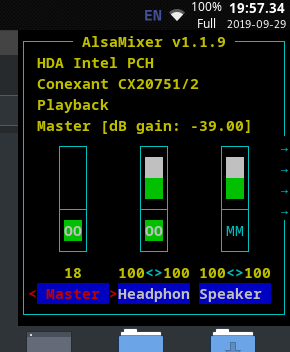

# ShellFront
[](https://gitlab.com/WylieYYYY/shellfront/commits/master)
[](https://gitlab.com/WylieYYYY/shellfront/commits/master)  
ShellFront is a simple frontend for linux shell scripts (Shellfront is pronounce as "shelf-front" as in the icon).
#### Screenshot
Alsamixer started from right-clicking the clock in tint2.  

### Features:
- Undecorated popup and decorated application style;
- Customise command to toggle, activate, or deactivate;
- Uses GTK+3 and VTE, portable between linux computers with those packages;

### Setup
Required dependencies:
```
autoconf automake libtool pkg-config
```
GTK+, VTE dependencies for ArchLinux: `gtk3 vte3`  
GTK+, VTE dependencies for Ubuntu: `libgtk-3-dev libvte-2.91-dev`  
Other distros should also install GTK+ and VTE development package from repositories or build from source.  
ShellFront can be installed by using autotools:
```
autoreconf -i
./configure
make
sudo make install
```
Can be uninstalled by using `sudo make uninstall`.
### Using directly in terminal
Different switches are available, help can be called with `shellfront --help` or `shellfront -h`
#### Gravity Setting
When gravity is set, the location variable will be interpreted as the distance from the edge specified.  
GTK+'s window positioning is known to be finicky.  
Default setting is `1 (Top-left)`.  
Corresponding coordinates as below:
```
+-----x
|1 2 3
|4 5 6
|7 8 9
y
```
If the gravity is centered in any axis, the corresponding x or y value of the loc variable will be ignored.  
A placeholder of any non-negative number should be used in the loc variable (Number appended by letters are also accepted).
#### Tips
To hide the console cursor, perform `printf` or `echo -n` spaces until out of bound, or by using `echo -n "$(command)[SPACES]"` on last output command.  
For the latter method, if colourised output from pipe is required, `unbuffer` from package `expect` can be appended in front of the command.
### Using as library within C program
ShellFront can customize how a terminal program appear as. Size, title, format and etc. can be fixed for maximum user experience.  
`shellfront_catch_io_from_arg(int argc, char **argv);` allows user to decide how the program will look like by commandline argument.  
`shellfront_catch_io(int argc, char **argv, struct term_conf config);` lets you to decide how it looks.  
> `stderr` will still be directed to the old terminal so that error will not appear to normal users.

The `term_conf` struct has default values for all variable, listed below:
```
Window and terminal properties
- grav for gravity        : 1 (Top-left)
- x and y for coordinate  : 0
- width                   : 80
- height                  : 24
- title                   : ""
- cmd for target command  : "echo -n  Hello World!; sleep infinity" (In terminal) or "" (In C library)
- interactive for input   : FALSE or 0
- ispopup                 : FALSE or 0
- once for single instance: FALSE or 0

Invoke behaviours switch
- toggle when invoked     : FALSE or 0
- killopt for killing     : FALSE or 0 
```
