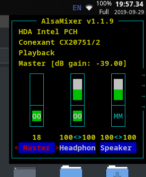
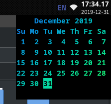

# ShellFront
[](https://gitlab.com/WylieYYYY/shellfront/commits/master)
[](https://gitlab.com/WylieYYYY/shellfront/commits/master)  
ShellFront is a simple frontend for terminal applications and Linux shell scripts. Making terminal application window customizable by user
or developer.
#### Screenshot
Alsamixer started from right-clicking the clock in tint2, demonstrates compatibility with Ncurses.  
`shellfront -Tips 30x14 -g 3 -c 'alsamixer'`  
  
Calendar popup with various tips and tricks from the [tips](https://gitlab.com/WylieYYYY/shellfront#tips) section.  
`shellfront -Tps 21x8 -g 3 -c 'echo -n "$(tput bold; unbuffer cal | lolcat -ft -) "; read'`  
  

### Features:
- Undecorated popup and decorated window style;
- Customise command to toggle, activate, or deactivate;
- Uses GTK3 and VTE, portable between Linux computers;
- Integrate to other applications as C library;
- Simple and intuitive, one struct for configuration and can be added in under 10 lines of code;

### Setup
1. Download the `build ready version` from the `releases` tab on the side
   and extract to a directory with a name without whitespaces. Then, install the following packages.
2. Install the following packages:  
   For ArchLinux: `gtk3 vte3 gettext`  
   For Ubuntu: `libgtk-3-dev libvte-2.91-dev gettext`  
   Other distros should also install GTK and VTE development package from repositories or build from source.
3. Change to the ShellFront directory by using `cd`
4. ShellFront can then be installed by using `./configure && make` and `sudo make install`

#### Testing (Not required for using ShellFront)
> The test is automatically run with each push, so it is not required to run manually.

If Docker is available, image can be found at `registry.gitlab.com/wylieyyyy/shellfront:latest`,
so the testing environment is sandboxed. Then start from running the command in step 5.

4. Finish step 3 from setup above, install `gcovr`.
5. Install `xvfb` and run `Xvfb :1 -screen 0 1600x1200x24 & export DISPLAY=:1` if no GUI is available.
6. Build with `./configure --enable-unit-tests && make` and run it by using `LANG=C src/test`
7. Check the result with `gcovr -r src -e 'src/t_*'` (append optional `-b` flag for branch coverage).

The package can be uninstalled by using `sudo make uninstall` in the same directory.
### Using directly in terminal
Different switches are available, help can be called with `shellfront --help` or `shellfront -h`
#### Gravity Setting
When gravity is set, the location variable will be interpreted as the distance from the edge specified.  
GTK's window positioning is known to be finicky.  
Default setting is `1 (Top-left)`.  
Corresponding coordinates as below:
```
+-----x
|1 2 3
|4 5 6
|7 8 9
y
```
If the gravity is centered in any axis, the corresponding x or y value of the loc variable will be ignored.  
A placeholder of any non-negative number should be used in the loc variable (Number appended by letters are also accepted).
#### Tips
- To hide the console cursor, perform `printf` or `echo -n` spaces until out of bound, or by using `echo -n "$(command)[SPACES]"` on last output command.
- If colourised output from pipe is required, `unbuffer` from package `expect` can be appended in front of the command.
- If the application is not interactive, `read` can be used instead of `sleep infinity` to make the window stay.

### Using as library within C program
ShellFront can customize how a terminal program appear as. Size, title, format and etc. can be fixed for maximum user experience.  
> `stderr` will still be directed to the old terminal so that error will not appear to normal users.

#### C library reference
`shellfront_catch(int argc, char **argv, char *accepted_opt, GOptionEntry *custom_opt, struct shellfront_term_conf default_config);` decides how the terminal will look like by user and/or program, parameters' explainations listed below:
```
- accepted_opt: A string of ShellFront options' short names which are allowed to be overriden by user, can be "" if user should not be able to modify ShellFront configuration
- custom_opt: Custom options for parent application, a NULL-terminated array of GOptionEntry, can be NULL if no custom options are needed
- default_config: The default configuration to be overriden by commandline arguments
```

The function above returns an `err_state`, the setup on the program should handle the result as follow:
1. If `has_error` of the state evaluate as true, something went wrong, 
   do standard error handling with `errmsg`, end the program without executing the main logic.
2. If `has_error` of the state evaluate as false:
   - If `errmsg` is `""`, this is currently running in ShellFront, continue the execution of the program.
   - If `errmsg` is not `""`, this is currently in the original process, end the program without executing the main logic.

Sample integration in C:
```c
#include "shellfront.h"

#include <stdbool.h>
#include <stdio.h>
#include <string.h>
#include <unistd.h>

int main(int argc, char **argv) {
	struct shellfront_term_conf config = shellfront_term_conf_default;
	config.width = 20;
	config.height = 6;
	config.desc = "- sample integration of ShellFront";
	bool msg_switch = false;
	GOptionEntry custom_opt[] = {
		{
			.long_name = "switch",
			.arg = G_OPTION_ARG_NONE,
			.arg_data = &msg_switch,
			.description = "Switches the message's text"
		}, { 0 }
	};
	struct err_state state = shellfront_catch(argc, argv, "gl", custom_opt, config);
	if (state.has_error) {
		fprintf(stderr, state.errmsg);
		return state.has_error;
	}
	else if (strcmp(state.errmsg, "") != 0) return 0;
	printf("Hi, switch is %s.\n", msg_switch? "on" : "off");
	fprintf(stderr, "Errors\n");
	pause();
	return 0;
}
```

The `err_state` struct has following members, listed below: (For default values, use `{ .has_error = 0, .errmsg = "" }`)
```
- has_error
- errmsg for error message
```
The `shellfront_term_conf` struct defines `shellfront_term_conf_default` constant, which has default values for all members, listed below:
```
Window and terminal properties
- grav for gravity        : 1 (Top-left)
- x and y for coordinate  : 0
- width                   : 80
- height                  : 24
- title                   : ""
- icon filepath           : "" (Uses window manager's default icon)
- cmd for target command  : "echo 'Hello World!'; read" (In terminal) (This is not used in C library)
- interactive for input   : false or 0
- popup instead of window : false or 0
- once for single instance: false or 0

Invoke behaviours switch
- toggle when invoked     : false or 0
- kill                    : false or 0
- desc for help menu      : "- simple frontend for shell scripts" (In terminal, immutable) or "" (In C library)
```
